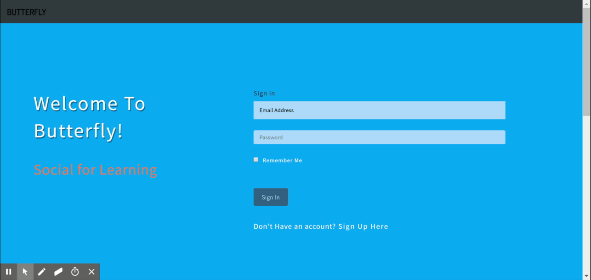
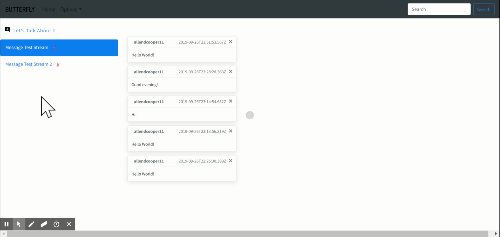

# Butterfly
Butterfly is a class communications platform designed to make it easier for students to participate in live class discussions ("Slack for education"). It is a MERN stack, single page application (SPA) built with React-Bootstrap styles that allows users in educational settings to create an account, login, create/subscribe to message streams for classes or groups, and communicate in real time. 

[https://social-butterfly-app.herokuapp.com/](https://social-butterfly-app.herokuapp.com/)

Demo user:

* class@bootcamp.com
* bootcamp1

## Overview
* App.js handles the routing to the three main 'pages':
 * Home page. This page displays a login form that, when submitted, uses an API call to server to authorize user and redirect to Streams page. It also contains a link that opens a pop-up window for a new user to register an account.
 * Streams page. The streams page runs an axios GET request when component mounts to retrieve the user data. It then renders the users subscribed streams. When a stream is clicked, it runs an API call to retrieve and then render all messages from that stream onto the page.
 * Search page. The search page runs an axios GET request when component mounts to retrieve all available streams that the user can subscribe to.

* User authorization is handled via the following process:
 * Create/Verify Credentials. API post request sends username and password from client to server, from server to database.
 * Hash Password for Security. Uses `bcrypt` library to hash password.
 * Establish User Session. This saves the user data in a cookie so that user doesn't have to be re-credentialed on every client call. Uses `express-session` to establish session, `passport` to save user credentials in the cookie, and `connect-mongo` to save session in the database. 

## Functionality
Overview of App:

Sending Message:
